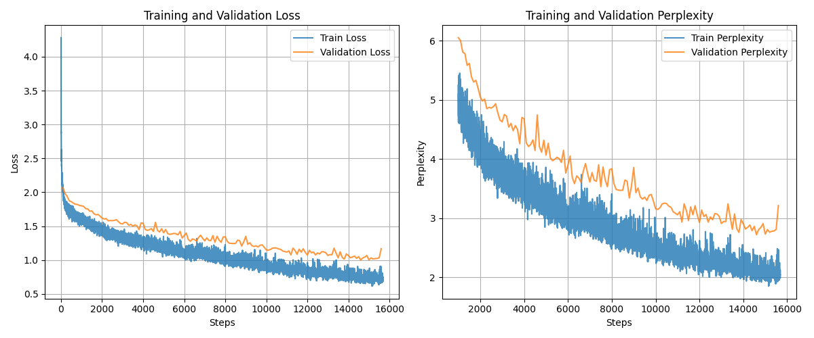

# LLM-Explorations

This repository contains a collection of various Language Modeling model architectures implemented from scratch in PyTorch, together with a simple training script on the [Tiny Shakespeare Corpus](https://github.com/karpathy/char-rnn/blob/master/data/tinyshakespeare/input.txt). This is both a learning exercise and for future exploration and experimentation with any new ideas on architecture design.

## Getting Started

1. Install PyTorch
2. Install dependencies
```bash
pip install -r requirements.txt
```
4. Run the training script
```bash
python train.py -h
```

## Experiments

Tokenization is on the character level by getting all the unique characters in the corpus and mapping them to a unique index. This results in a vocabulary size of 65.

#### Training Hyperparameters

- batch_size = 64
- seq_len = 32
- num_epochs = 1 (Total steps = 15685)
- optimizer = AdamW
- weight_decay = 0.01
- init_lr = 3e-3
- min_lr = 1e-3
- lr_schedule = cosine decay to min_lr with no warmup
- eval_every = 100


### Transformer

Decoder-only Transformers are more suited for autoregressive language modeling. Thus instead of implementing a Transformer model based on the original [Attention is All You Need](https://arxiv.org/abs/1706.03762) paper, I opted for a decoder-only Transformer similar to the famous [LLaMA](https://arxiv.org/abs/2407.21783) model. This is a scaled down version of Llama. It contains the same features as Llama like pre-RMSNorm, SwiGLU activation function, RoPE embeddings, etc.

#### Model Architecture

| Parameter | Value |
|-----------|--------|
| num_layers | 4 |
| num_heads | 8 |
| d_model | 128 |
| d_feedforward | 341 (2/3 x 4 x d_model) |
| dropout | None |
| positional_embedding | RoPE |
| RoPE theta base | 10000.0 |
| Normalization | pre-RMSNorm |
| Activation Function | SwiGLU |

Total number of parameters: 1,112,781

#### Results

<div style="display: flex; flex-wrap: wrap; justify-content: center;">
    <div style="width: 100%;">
        
    </div>
</div>

The validation loss converges to about 1.02. To obtain a more meaningful understanding of what this value means, we can calculate the perplexity. The perplexity is also equivalent to how many tokens the model is choosing between randomly at each step. From the perplexity plot, we can see that validation loss of 1.02 corresponds to perplexity of about 2.75. This means that on average, the model is choosing between 2.75 tokens at each step, which is much better than random guessing (perplexity of 65 for a 65-token vocabulary). This seems to indicate that the model has learnt and generalized reasonably well to the validation set without overfitting to the training data.
