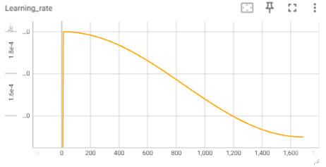

# LLM-Explorations

This repository contains a collection of various Language Modeling model architectures implemented from scratch in PyTorch, together with a simple training script on the [Gutenberg Poetry Corpus](https://github.com/aparrish/gutenberg-poetry-corpus). This is both a learning exercise and for future exploration and experimentation with any new ideas on architecture design.

## Getting Started

1. Install PyTorch
2. Install dependencies
```bash
pip install -r requirements.txt
```
3. Unzip the corpus file
```bash
gunzip gutenberg_poetry_corpus.ndjson.gz
```
4. Run the training script
```bash
python train.py -h
```

## Experiments

- batch_size = 128
- seq_len = 128
- num_epochs = 1
- optimizer = AdamW
- weight_decay = 0.01
- warmup_steps = 100
- init_lr = 2e-4
- min_lr = 1.5e-4
- lr_schedule = cosine decay to min_lr with warmup
- eval_every = 100




### Classical Transformer

The same model configuration as the original [Attention is All You Need](https://arxiv.org/abs/1706.03762) paper is used.

<div style="display: flex; flex-wrap: wrap; justify-content: space-between;">
    <div style="width: 48%;">
        <h4>Training Loss</h4>
        
    </div>
    <div style="width: 48%;">
        <h4>Validation Loss</h4>
        
    </div>
    <div style="width: 48%;">
        <h4>Training Token Accuracy</h4>
        
    </div>
</div>
